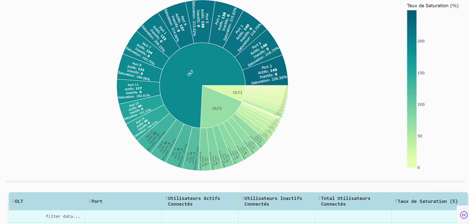

# 📊 Network Port Congestion Analysis & Monitoring Dashboard

## 🧠 Problem  
Telecommunication networks face increasing **port-level congestion** driven by subscriber growth and limited GPON capacity.  

This results in:
- degraded service quality  
- inefficient capacity allocation  
- lack of visibility on network load distribution  

Additionally, operational data is often **fragmented and manually processed**, limiting real-time decision-making.  

---

## 🎯 Solution  
Design and development of an **interactive analytics platform** to monitor, analyze, and interpret network port saturation in real time.  

The system provides:
- centralized data analysis  
- dynamic congestion monitoring  
- decision-support visualizations
-  Detect overloaded network ports  
- Analyze subscriber impact on capacity  
- Enable data-driven network optimization  

---

## ⚙️ Technologies  
- Python  
- Pandas, NumPy  
- Plotly  
- Dash  
- Flask  
- Dash Bootstrap Components  
- Scikit-learn (basic predictive modeling)  

---

## 🚀 Key Features  

- **Port Congestion Analysis**  
  - saturation rate computation per port and OLT  
  - configurable capacity (GPON splitters)  

- **Interactive Dashboard**  
  - KPI-driven visualization  
  - multi-level exploration (region, offer, time)  

- **Advanced Data Exploration**  
  - dynamic filtering  
  - multi-dimensional analysis  

- **Temporal Analysis**  
  - trend detection and performance tracking  

- **Data Integration**  
  - multi-source ingestion (CSV/Excel)  
  - validation and preprocessing pipeline  

- **Automated Reporting**  
  - structured outputs for operational decision-making  

---

## 🏗️ Architecture  

The application follows a **modular architecture** composed of:  
- data processing and transformation layer  
- business logic (telecom-specific metrics & congestion modeling)  
- visualization layer (interactive dashboards)  

This design ensures scalability, maintainability, and extensibility.  

---
## 🎥 Demo



```bash
python application_dashboard.py
